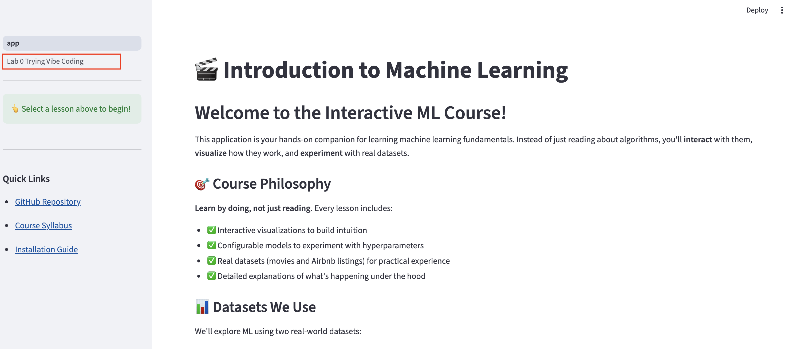

# 🚀 Installation Guide

### Step 0: Clone the Repository

We use Git for version control. Git is a distributed version control system that allows you to track changes in your code, collaborate with others, and revert to previous versions if needed.

**Why use Version Control?**
- **History**: Track every change made to the codebase.
- **Collaboration**: Work with teammates without overwriting each other's code.
- **Safety**: Revert breaking changes and keep a backup of your work.

**Basic Commands** ([Git Cheat Sheet](https://education.github.com/git-cheat-sheet-education.pdf)):
- `git clone <url>`: Download a repository from git to your computer.
- `git status`: See which files have changed.
- `git add .`: Stage all changed files for commit.
- `git commit -m "message"`: Save staged changes with a message.
- `git push`: Upload commits to GitHub.
- `git pull`: Download the latest changes from GitHub.

Now let's clone the course folder to your laptop! Open a terminal and run the following commands. This will create a local copy of this GitHub repository on your laptop, which you can edit to complete the labs.

```bash
git clone https://github.com/kyunghyuncho/CSCI-UA-473-Fundamentals-of-MachineLearning-Spring-2026.git
cd CSCI-UA-473-Fundamentals-of-MachineLearning-Spring-2026
```

(Optional) Here is an interactive [course](https://learngitbranching.js.org/) if you want to learn more about Git.

### Step 1: Download IDE


**Background: What is an IDE?**
An **IDE** (Integrated Development Environment) unifies coding, debugging, and testing tools to streamline development. An IDE also makes it much easier to use AI to brainstorm, edit, and test your code.

**AI-Native IDEs**
The standard has been **VS Code** with **GitHub Copilot**, but tools like **Cursor**, **Claude Code**, and **Antigravity** are evolving the concept. Most of these are **forks of VS Code**, meaning they support your favorite extensions but bake AI into the core for a smoother "**Vibe Coding**" experience compared to using AI as just a plugin.


The doc will be focused on antigravity, but you can use either antigravity or VSCode (with copilot). Even if you have used one of these IDEs previously, be sure to read through the instructions to ensure you are able to access the appropriate educational credits.

#### Antigravity Guide

Campuswire [post](https://campuswire.com/c/GFC1A6E10/feed/3) by Kyunghyun:


> if you plan to use Antigravity instead of VS Code, please get Google Gemini: Free Pro Plan for Students. this will give you a much higher rate limit on Gemini models when using them via Antigravity:

> https://gemini.google/students/

> once you get Gemini Pro Plan, you can download Antigravity and start vibe-coding!

> https://antigravity.google/

#### Copilot Guide

Campuswire [post](https://campuswire.com/c/GFC1A6E10/feed/2) by Kyunghyun:

> 1. make sure you get an education pack for Github before the semester begins by going to

> https://education.github.com/pack

> 2. once you get the education pack, make sure you enable Github Copilot Pro by

> Free access to Copilot Pro while you're a student. To enable Copilot Pro, go to your account settings and under Code, planning, and automation, select Copilot to sign up for free.

> 3. then, you can download VS Code and start using Copilot as your coding assistant:

> https://code.visualstudio.com/

#### Getting started with AI-powered IDE

1. Open the IDE and select "Open Folder" (antigravity) or "Open" to open the `CSCI-UA-473-Fundamentals-of-MachineLearning-Spring-2026` folder (what you just cloned in step 0).
2. Open the terminal (shortcut: Ctrl + Shift + ` or move your mouse to the top of the screen and click **"Terminal" -> "New Terminal"**).
3. Open the file `scripts/lab0/setup_env.sh`. Try to understand what it does. Do **NOT** run the script until you roughly understand what it is doing. **If you are using windows, you might need to modify some commands.** For example, uv installation is [different](https://docs.astral.sh/uv/getting-started/installation/) on windows.

Some important notes for beginners:
1. You might see green and red ghost texts. Those are suggestions from the AI assistant (green for add and red for delete). You can ignore them for now.
2. For in-line suggestions, reject them using the `esc` key and accept using the `tab` key. For Antigravity agent chat suggestion, accept using `Cmd + Enter` and reject using `Cmd + backspace`. For Copilot agent chat suggestion, accept using `Shift + Cmd + Y` and reject using the button or repeatedly press `Cmd + Z` (default cancel shortcut overlaps with opening new window).
3. If you ever accidentally press accept or delete, don't panic. You can always revert the changes by undoing using `Cmd+Z` or running `git restore <filename>` (for any tracked files).


---
### Step 2: Create a Virtual Environment

Run the following script to set up the environment. Read the script to understand what it's doing while you wait for the installation to complete.

```bash

source scripts/lab0/setup_env.sh
```

> **Why?** Think of a virtual environment like a **separate kitchen** for each meal you cook. In one kitchen (project), you might need specific ingredients (libraries) like `pytorch 2.0`, while another kitchen needs `pytorch 1.0`. By keeping them separate, you avoid mixing ingredients that don't taste good together! As a general rule, you should keep a separate virtual environment for each project or code-base.
>
> In production settings, people often use stronger isolation tools like **Docker** or **enroot** (containers), which ship the entire kitchen (OS + libraries) along with the meal.


If you ever mess up the environment, delete and restart by running the following command to delete the files associated with the virtual environment. Once this is done, you can make a new virtual environment with the first command (above).
```bash
rm -rf .venv
```

Every time you open a project to start working, you need to select which environment ("kitchen") you want to use. We call this activating your environment, and you can use this command to activate the virtual environment we just created:
```bash
source scripts/lab0/activate_env.sh
```

### Step 3: Install Dependencies

Now that the virtual environment is created, we need to specify the packages we want to use when running code in this environment (these packages are called dependencies). To do this, we will use uv, which is a commonly used package manager. We have already provided a list of the required dependencies for the labs in the course in `pyproject.toml`. Run the following commands to install these packages in your virtual environment:

```bash
uv sync
uv pip install -e .
```

**Dependencies include**:
- `streamlit` - Interactive web interface
- `torch` + `pytorch-lightning` - Deep learning framework
- `transformers` - For loading embedding models
- `sentence-transformers` - Text embeddings (Nomic AI)
- `pandas`, `numpy` - Data manipulation
- `altair`, `plotly` - Visualizations
- `scikit-learn` - ML utilities
- `Pillow` - Image processing
- `pre-commit` - Automation for code quality checks

### What is a Pre-commit Hook?
A pre-commit hook is a script that runs automatically before you commit changes to git. In this course, we use it to enforce code style and catch errors early. It will run:
- **Black**: To format your code automatically.
- **Flake8**: To check for syntax errors and style violations.
- **Isort**: To sort your imports alphabetically.

If any check fails, the commit is blocked until you fix the issues (or they are fixed automatically by the tool).

Verify that the installation was successful by running:
```bash
python scripts/lab0/verify_installation.py
```

### Step 4: Launch the App

```bash
streamlit run app.py
```

You should see this interface


Try Lab 0 by clicking "Lab 0 Trying Vibe Coding" (highlighted with red box) on the left sidebar. The app is generated by, and actively synced with the codebase, allowing you to see code changes reflected directly in the interface.

Congratulations! You have successfully installed the environment and can now start working on the labs :)

---

## 📊 Dataset Preparation (Optional)

Datasets are required for the main lessons but not Lab 0.

For the main lessons, you must **process the datasets** to generate embeddings.

### TMDB 5000 Movies (Default Dataset)

**About**: 5,000 movies with titles, descriptions, genres, ratings, revenue, and posters.

```bash
python process_data.py
```

**What this does**:
1. Downloads TMDB dataset from Hugging Face (~10MB)
2. Generates text embeddings using Nomic AI model (~2-3 minutes)
3. Saves processed data to `data/processed/tmdb_embedded.parquet`

**Optional - Add Movie Posters**:
```bash
python process_images.py
```
This downloads posters and generates image embeddings (~15-30 minutes depending on network speed).

### NYC Airbnb Listings (Alternative Dataset)

**About**: 5,000 NYC Airbnb listings with descriptions, amenities, prices, ratings, and photos.

```bash
python process_airbnb.py
```

**What this does**:
1. Downloads Airbnb dataset from Inside Airbnb (~5MB)
2. Samples 5,000 listings (configurable)
3. Generates text and image embeddings (~10-20 minutes)
4. Saves to `data/processed/airbnb_embedded.parquet`

**Options**:
```bash
# Sample only 5,000 listings (faster)
python process_airbnb.py --sample 5000

# Force complete reprocessing
python process_airbnb.py --force
```

### Optional: Deduplicate TMDB Dataset

If you want the cleanest possible dataset:
```bash
python scripts/deduplicate_data.py
```
Run this **before** `process_data.py`. See `scripts/README.md` for options.
